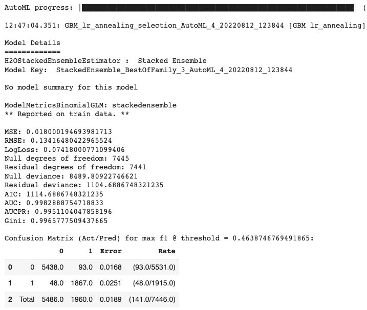
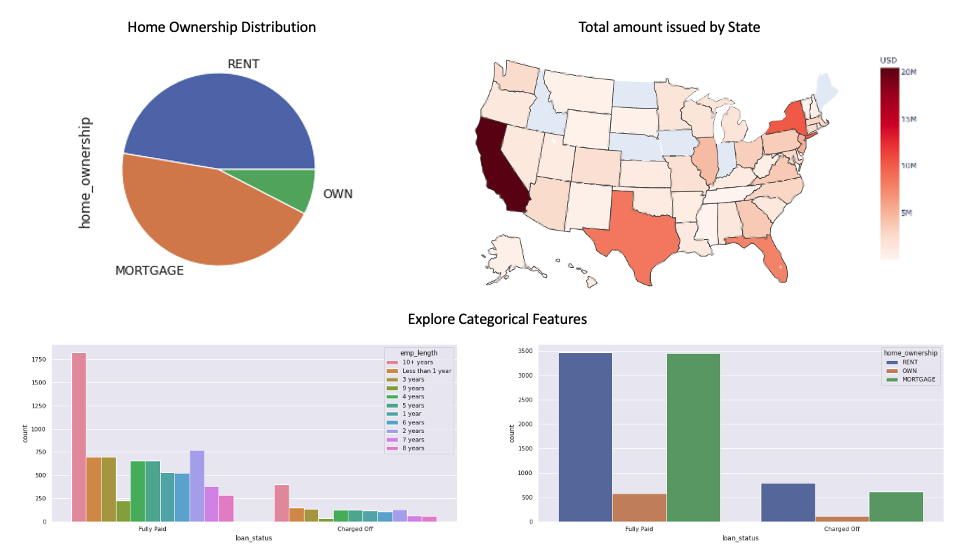
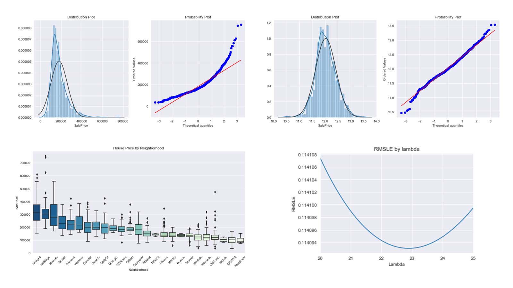
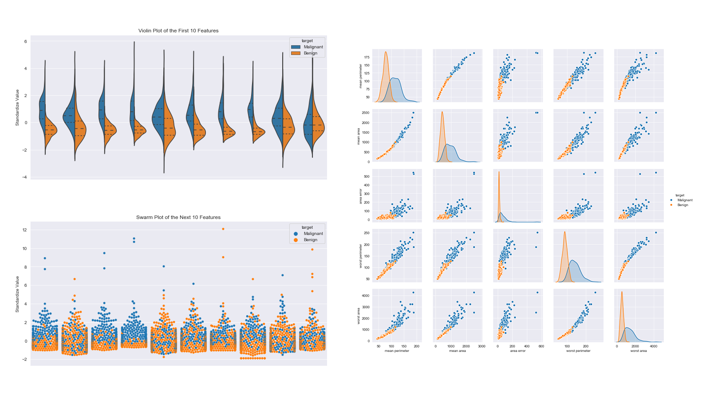

# Portfolio
---

## Work Experience Using Sample Version
### Customer Purchasing Prediction in Home Insurance Industry [Sample Model]

Project Summary: I created machine learning models for the home insurance comparison search engine to predict customer purchasing probability,delivered customer insights to sales department with 8% increase in operational efficiency [Random Forest, XGBoost, H2O]
 
Importance: For the slowed conversion rate: Creating a classifier model to predict user purchasing probability can enable salespeople prioritize and focus on users with a high purchasing rate to increase revenue

**Establish metadata framework for ease of automation:** 

**Random Forest Performance:** 

**AutoML Performance** 

 
---

###  Credit Risk Modeling and Prediction (Probability of Default Model) [Sample Model]

Project Summary: I developed the Probability of Default model for investors of a P2P lending company to assess counterparties’ credit rating; Implemented logistic regression to build a Personal Lending model mapping the default probability to an ordinal rating system as a predictor for loan interest rate [Python];Confirmed model robustness and generalizability through backtesting, benchmarking against alternative models, sensitivity tests, and model assumptions testing [Decision Tree, Random Forest, K-fold Cross-validation]

**Exploratory Data Analysis:** 

**Model Performance:** 

 
---

## Project Experience
### Movie Recommendation Engine Development in Apache Spark

Project Summary: Recommender systems are well-studied and proven to provide tremendous values to internet businesses and their consumers; I implemented ALS matrix factorization on 100,000 ratings to provide personalized movies recommendations and developed user-based approaches to handle system cold-start problem with RMSE 0.69; Tuned hyperparameters via Spark ML cross-evaluation toolbox and monitored data processing performance via Spark UI on AWS

**Application: make recommendations to users with given userIds**
 

 
**Application: find similar movies for movies with given movieIds**

 
---
### Bank Customer Churn Analysis and Prediction

Project Summary: I developed supervised learning models to identify customer churn probability and analyze top factors that influence user retention; Preprocessed data for downstream statistical analysis through imputation of missing values, outlier detection, and categorical
feature transformation; Trained Logistic Regression, SVM, Random Forest and XGboost via K-fold Cross-validation; Applied regularization with optimal hyperparameter to overcome overfitting and evaluated model performance via F1 score 0.86

**Exploratory Data Analysis for numerical feature :**
 

 
**Model Performance:**

 

### Food Search Engine

Project Summary: This food search engine is designed to support individual users to explore detailed behind-scene facts of certain food products that match their criteria; Established full-text search functionality with Elasticsearch in combination with MongoDB to query unstructured data sources; Created a Flask front-end interface to form an API connection with backend data-sources as an interactive, web-based point of contact for search queries

**MongoDB & Elasticsearch:**
 

 
**Flask Demo:**

 

---
## Data Science

### Credit Risk Prediction Web App

After my team preprocessed a dataset of 10K credit applications and built machine learning models to predict credit default risk, I built an interactive user interface with Streamlit and hosted the web app on Heroku server.

 

 

---
### Kaggle Competition: Predict Ames House Price using Lasso, Ridge, XGBoost and LightGBM

I performed comprehensive EDA to understand important variables, handled missing values, outliers, performed feature engineering, and ensembled machine learning models to predict house prices. My best model had Mean Absolute Error (MAE) of 12293.919, ranking <b>95/15502</b>, approximately <b>top 0.6%</b> in the Kaggle leaderboard.

 

 

---
### Predict Breast Cancer with RF, PCA and SVM using Python

In this project I am going to perform comprehensive EDA on the breast cancer dataset, then transform the data using Principal Components Analysis (PCA) and use Support Vector Machine (SVM) model to predict whether a patient has breast cancer.

 

 

---
### Business Analytics Conference 2018: How is NYC's Government Using Money?

In three-month research and a two-day hackathon, I led a team of four students to discover insights from 6 million records of NYC and Boston government spending data sets and won runner-up prize for the best research poster out of 18 participating colleges.

 

 

---
## Filmed by me

Besides Data Science, I also have a great passion for photography and videography. Below is a list of films I documented to retain beautiful memories of places I traveled to and amazing people I met on the way.

 

- [Ada Von Weiss - You Regret (Winter at Niagara)](https://www.youtube.com/watch?v=-5esqvmPnHI)
- [The Weight We Carry is Love - TORONTO](https://www.youtube.com/watch?v=vfZwdEWgUPE)
- [In America - Boston 2017](https://www.youtube.com/watch?v=YdXufiebgyc)
- [In America - We Call This Place Our Home (Massachusetts)](https://www.youtube.com/watch?v=jzfcM_iO0FU)

---

© 2020 Khanh Tran. Powered by Jekyll and the Minimal Theme.

